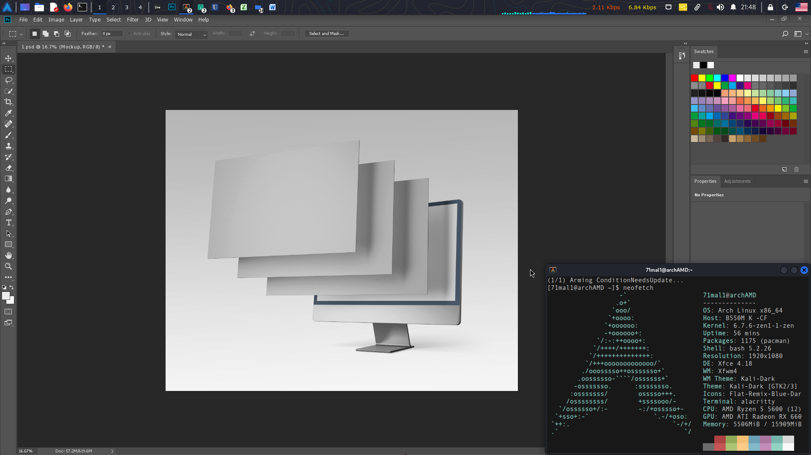
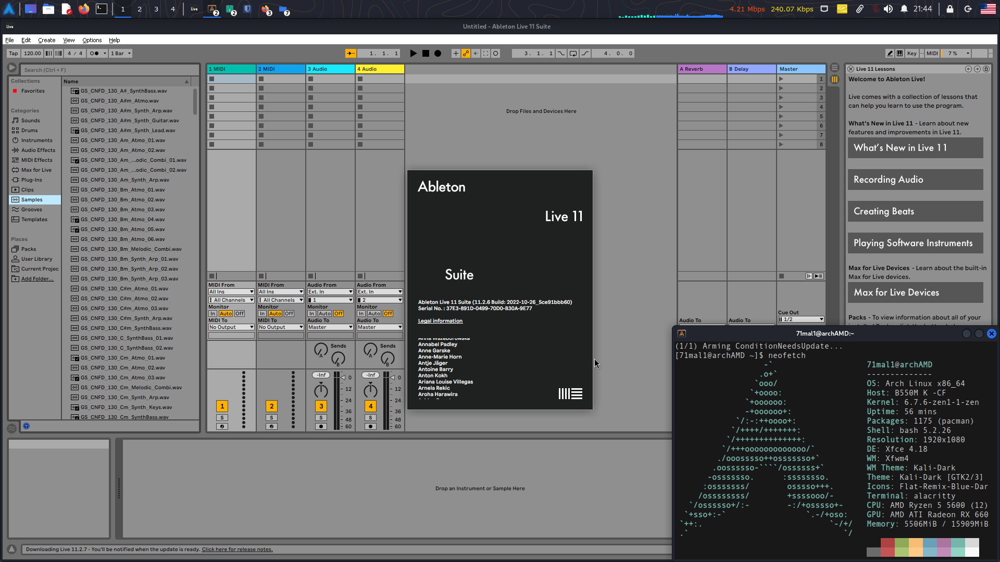

##  alacritty
~/.config/alacritty

yay -S ttf-menlo-powerline-git
  
- copy -> ~/.config/

## oh my zsh
~/.zshrc

sudo pacman -S zsh

chsh -s /bin/zsh

sh -c "$(curl -fsSL https://raw.githubusercontent.com/ohmyzsh/ohmyzsh/master/tools/install.sh)"

git clone https://github.com/zsh-users/zsh-autosuggestions ${ZSH_CUSTOM:-~/.oh-my-zsh/custom}/plugins/zsh-autosuggestions

## tmux
~/.tmux.conf

tmux source-file ~/.tmux.conf 

## wine

