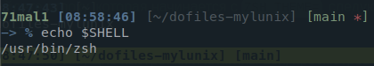

##  alacritty
~/.config/alacritty

yay -S ttf-menlo-powerline-git

## oh my zsh
~/.zshrc

sh -c "$(curl -fsSL https://raw.githubusercontent.com/ohmyzsh/ohmyzsh/master/tools/install.sh)"

## tmux
~/.tmux.conf

